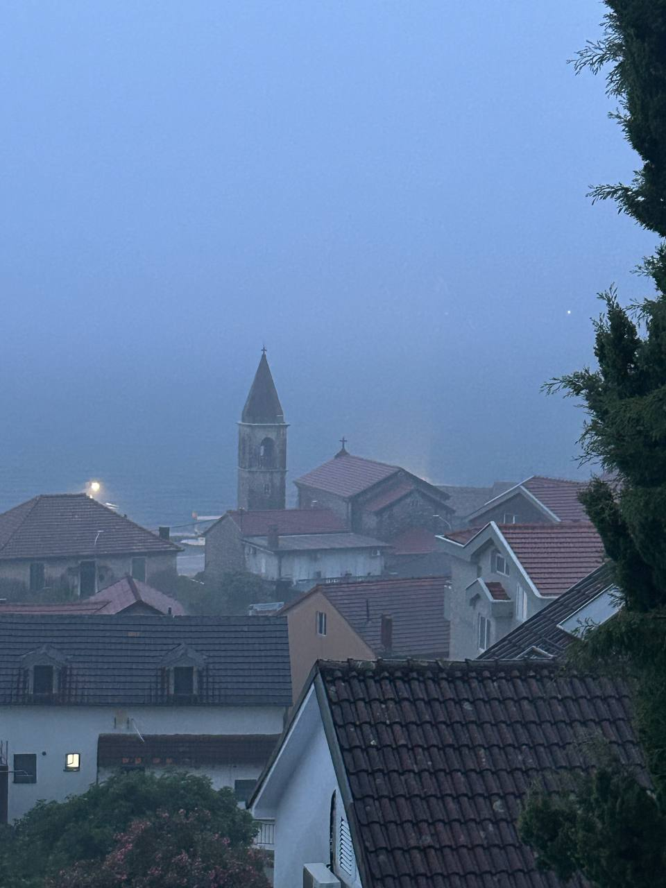

Tivat čeka kišu. Sivo more i sivo nebo. More je prazno, nema ni jednog čamca ni glisera. Samo jedan veliki brod s pet jarbola brzo plovi s podignutim jedrima. Ponekad se čuje grmljavina i vide se munje.

Padaju prve kapi. Kiša je počela. Sve je postalo belo kao u mleku. Suprotna obala više nije vidljiva, nije vidljivo ni more.

==

Тиват ждёт дождя. Серое море и серое небо. Море пустое, ни одной лодки или глиссера. Только один большой корабль с пятью мачтами быстро плывёт с поднятыми парусами. Иногда слышен гром и видны молнии.

Падают первые капли. Дождь начался. Всё стало белым, как в молоке. Противоположный берег больше не виден, не видно и моря.

